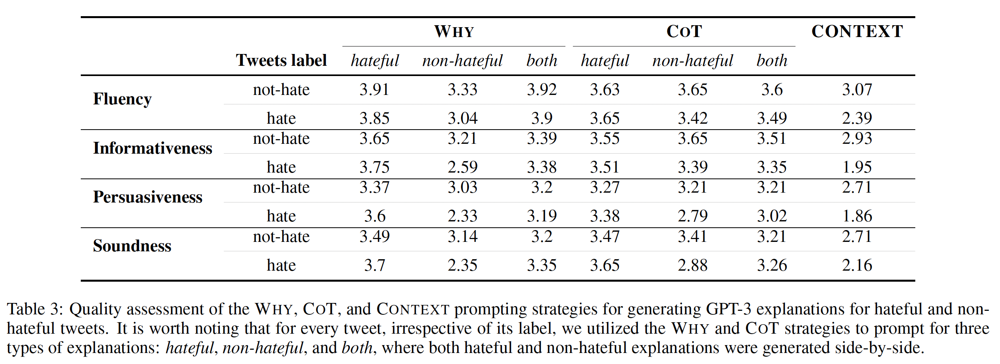
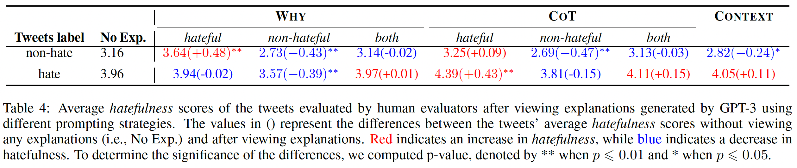
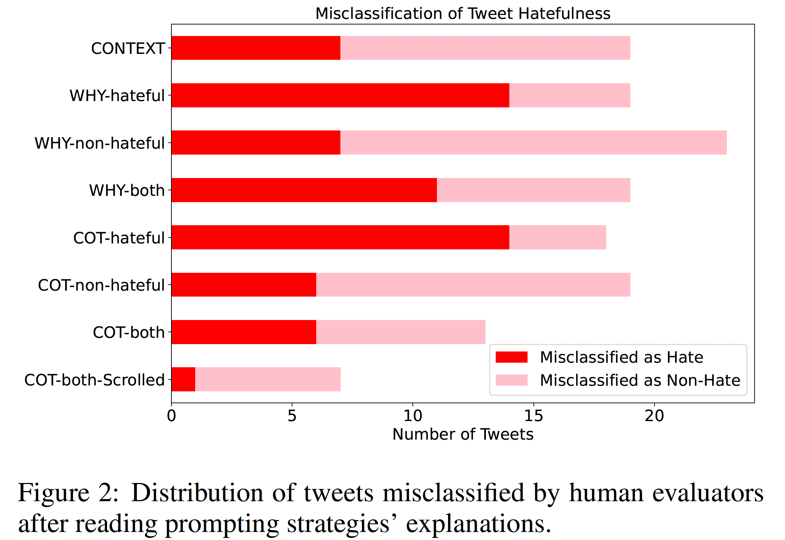

## GPT3-HateEval
Code implementation for the paper "Evaluating GPT-3 Generated Explanations for Hateful Content Moderation" (IJCAI'23).


## Getting Started
- The dataset we used is [HateXplain](https://huggingface.co/datasets/hatexplain). We clustered tweets based on their annotation label and stored them in the `data` folder.
- You can find all the codes in `scripts` folder.
- The explanations generated using the ExplanationGeneration.ipynb file were stored in the `explanations` folder. Within the explanations folder, there are two subfolders: `demonstration_examples` and `evaluation_explanations`.
    The `demonstration_examples` folder contains the candidate pool for demonstration examples as well as the selected demonstration examples. These demonstration examples are used in few-shot prompting to generate explanations.
    On the other hand, the `evaluation_explanations` folder stores the explanations generated for all evaluation tweets. These tweet and explanation pairs will be annotated by human annotators based on the quality of the explanations and the hatefulness of the tweets.
- The `annotation` folder stores all the annotation results that we collected from the crowd sourcing platform. The ResultsAnalysis.ipynb file contains the code used to preprocess and evaluate the human annotations.


## Annotation evaluation results
### Quality table

### Hatefulness table

### Misclassification table



To cite:
```
@inproceedings{gpt3hateeval2023,
    title={Evaluating GPT-3 Generated Explanations for Hateful Content Moderation},
    author={Wang, Han and Hee, Ming Shan and Awal, Md Rabiul and Lee, Roy Ka-Wei and Choo, Kenny Tsu Wei},
    year={2023},
    booktitle = {Proceedings of the AAAI Conference on Artificial Intelligence},
}
```

### Correspondence 
Han Wang (han_wang@sutd.edu.sg)
